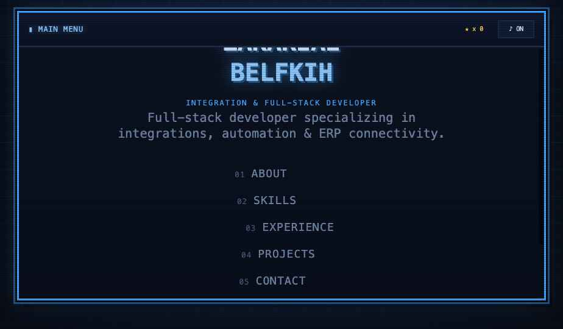

# ZAKARIAE BELFKIH — Arcade Portfolio

My developer portfolio, built as a playable retro arcade cabinet: CRT scanlines, a BIOS boot
sequence, and five "levels" instead of five sections.

**Integration & full-stack developer** — Rabat, Morocco. Open to remote.
[LinkedIn](https://linkedin.com/in/zakariae-belfkih) · [X](https://x.com/7_akaria) · zakariablefkih@gmail.com



## What's in it

- **Boot sequence** — BIOS-style log, loading bar, `PRESS START`
- **Five levels** — About (player profile), Skills (RPG stat sheet), Experience (quest log),
  Projects (cartridge select), Contact
- **Options screen** — accent colour, scanline intensity, pixel typeface, animation speed,
  sound/music, and a save-data panel with achievements
- **Integration map** — canvas hero behind the menu, animating data packets between NetSuite,
  Shopify, Amazon, Walmart, Salesforce and EDI
- **Chiptune + SFX** — generated live with the Web Audio API; no audio files
- **Achievements & XP** — 18 achievements persisted in `localStorage`, with a reset from Options
- **Attract mode** — auto-cycles the levels after 16s idle, like an arcade demo reel
- **A hidden three-game cabinet** — `↑ ↑ ↓ ↓ ← → ← → B A` unlocks DEV MODE and its INSERT COIN row:
  - *Packet Catch* — catch good data, dodge corrupted packets
  - *Tetris* — 10×20 well, seven pieces, bag randomiser, wall kicks, lock delay
  - *Pac-Man* — original maze, four collectors with distinct chase personalities, power tokens
  All three are hand-written canvas games sharing the same modal chrome. If you can't find the
  code, the menu eventually nudges you toward it.
- **Gesture control** (opt-in) — point and pinch to navigate with your webcam, via MediaPipe
  hand landmarks. Off by default; nothing is uploaded, tracking runs in the browser.

## Controls

| Input | Action |
| --- | --- |
| `1`–`6` | Jump straight to a level |
| `↑` `↓` + `Enter` | Navigate the main menu |
| `Esc` | Back to the menu |
| Click anywhere | Skip the typewriter animation |
| `↑ ↑ ↓ ↓ ← → ← → B A` | Konami code — DEV MODE |

## Running it locally

It needs to be served over HTTP. Opening `index.html` from the filesystem will **not** work —
Babel fetches each `.jsx` over XHR and browsers block that on `file://`.

```bash
python3 -m http.server 8801 --directory .
```

Then open <http://localhost:8801>.

## Stack

No build step, no dependencies to install. React 18 + Babel standalone are loaded from a CDN
with subresource integrity, and everything else is hand-written:

| File | Role |
| --- | --- |
| `index.html` | Shell, fonts, CDN scripts, CRT overlays |
| `app.jsx` | Root: boot phase, screen routing, HUD, XP, attract mode |
| `screens.jsx` | The five content levels and the main menu |
| `options.jsx` | Options screen + achievements panel |
| `viz.jsx` | Integration-map hero canvas, ambient particles |
| `motion.jsx` | Text-scramble reveal, cursor-parallax tilt |
| `fx.jsx` | Boot screen, segmented typewriter |
| `extras.jsx` | Achievements, toasts, Konami, attract mode |
| `minigame.jsx` | *Packet Catch* |
| `tetris.jsx` | *Tetris* |
| `pacman.jsx` | *Pac-Man* |
| `gestures.jsx` | Webcam hand-gesture control |
| `audio.js` | Web Audio chiptune engine and SFX |
| `styles.css` | The whole pixel/CRT design system |

Accessibility: honours `prefers-reduced-motion` — the boot animation, typewriter, scanline
flicker and screen transitions all stand down.
